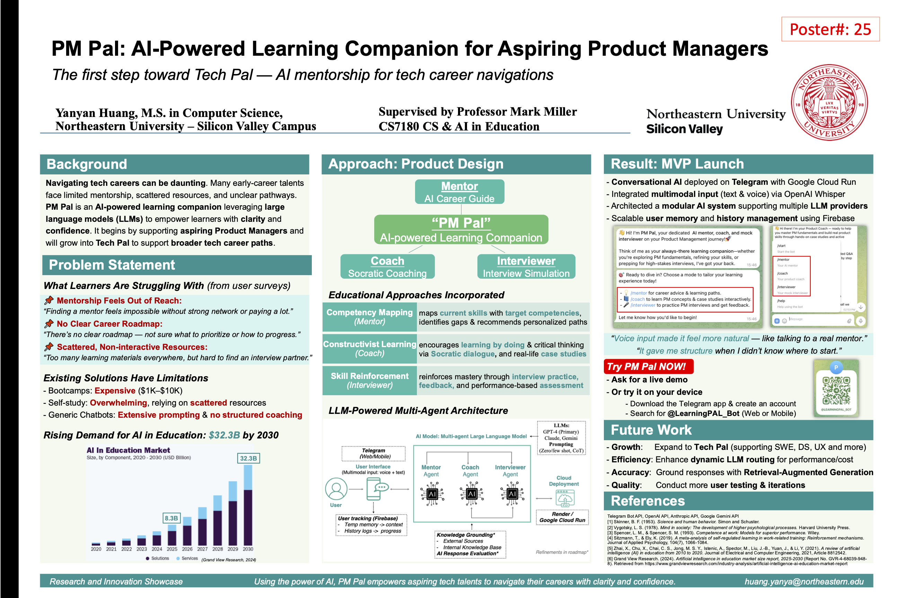

# AI-Powered Learning Companion (for Tech Talents) 🎓 🚀

## 📌 Overview

**PM/Tech Pal** is an **AI-powered learning companion** provides **mentorship, tutoring, and mock interview coaching** for **aspiring and transitioning Product Managers/Tech Talents**. It leverages AI to offer **structured learning paths, real-time feedback, and interactive interview practice**. Users interact with PM Pal through **Telegram** with natural language — both voice and text. 

---
## 📌 Project Poster



---

## 💡 Key Technical Highlights

- Deployed a production-grade Telegram bot using Docker & Google Cloud Run with webhook-based architecture
- Architected a modular AI system supporting multiple LLM providers: OpenAI, Anthropic Claude, and Google Gemini
- Integrated multimodal input via OpenAI Whisper (voice-to-text) and structured user state tracking
- Scalable user memory and history management using Firebase Firestore
- Secure configuration via `.env.yaml` for environment-specific deployment using `gcloud`
- Designed for future extensibility: roles, web UI, RAG pipeline, and performance tracking
---

## 💼 For Hiring Managers

This project demonstrates my ability to:

- Architect and deploy end-to-end AI systems in production
- Work with LLM APIs (OpenAI, Claude, Gemini) and route intelligently
- Build modular, maintainable backend logic in Python
- Handle real-time communication via webhook APIs (Telegram)
- Communicate technical systems clearly via documentation and diagrams

---

## 🔧 Tech Stack

| Layer                | Tools & Libraries                                              | Description                                                                 |
|----------------------|---------------------------------------------------------------|-----------------------------------------------------------------------------|
| **Bot Platform**     | [Telegram Bot API](https://core.telegram.org/bots/api)        | Enables user interaction via chat and voice messages                        |
| **Backend**          | Python                                                        | Core language for bot logic and orchestration                               |
| **AI/LLM Integration** | LangChain, OpenAI (GPT-4), Anthropic (Claude), Google Gemini | Supports flexible routing to different LLM providers                        |
| **Prompt Design**    | Custom system prompts (`prompts.py`)                          | Tailored instructions for mentor, coach, and interviewer modes              |
| **Voice Support**    | MoviePy, OpenAI Whisper API                                   | Converts `.ogg` → `.mp3`, transcribes to text using Whisper                 |
| **Data Storage**     | Firebase Firestore                                   | Stores user mode, memory, full conversation history (user input & AI response); supports future analytics and performance feedback |
| **Environment Config**| python-dotenv                                                 | Loads environment variables securely from `.env`                            |
| **Deployment**       | Docker, Google Cloud Run, gcloud CLI                          | Containerized deployment with webhook support, auto-scaling, and env-based config |

 ---  
## 🎯 Core Features:

👉 **Mentor Mode** – AI recommends personalized gap analysis and structured learning paths tailored to individual goals.  
👉 **Coach Mode** – AI provides interactive Q&A and guided case study to enhance critical thinking and experiential learning.  
👉 **Mock Interview Mode** – AI simulates different types of PM interviews and gives structured feedback for improvements.  
👉 **Telegram Bot** – Users interact with the AI directly via Telegram, with text and voice support.  
👉 **Flexible LLM routing** – Switchable LLM providers: OpenAI (primary), Claude, Gemin selected dynamically via config.  
👉 **Multimodal input** – Text and voice (speech-to-text via Whisper).  
👉 **Webhook-Based Bot** – cloud-scalable via Google Cloud Run.  
👉 **Database Integration (Firestore)** – Scalable, structured storage of user state, memory snapshots, and full conversation history for for structured user data, analytics, and future feedback loops.  
👉 **Session Memory** – Short-term memory used in LLM prompting per mode.  
👉 **History Logging** – Full archive of user sessions and LLM responses.  

---
## 📂 **Folder Structure**

```
/Project_directory
│
├── telegram_bot.py               # 🔹 Main entry point — sets up and runs the Telegram bot
├── handlers.py                   # 🔹 Handles /start, /help, /mode, text, and voice messages
│
├── bot_user.py                   # 🧠 Manages user session data, mode, memory, and interaction logging
├── conversation_manager.py       # 🧠 Coordinates user input, mode switching, and LLM response
├── llm_router.py                 # 🧠 Routes requests to OpenAI, Claude, or Gemini (via LangChain or Gemini API)
│
├── prompts.py                    # 📋 Prompt templates for mentor, coach, interviewer modes
├── greetings.py                  # 📋 Greeting messages for each mode
│
├── config.py                     # ⚙️ Loads environment variables and API key validations
├── firebase_db.py                 # Firebase Firestore setup for data storage
├── README.md                     # 📖 Project overview and usage instructions
├── requirements.txt               # 📦 (Optional) Dependencies
├── .env                           # 🔐 (Optional) Environment variables file
```
---
## 🧠 Architecture Highlights

- **ConversationManager** ties together `BotUser` (user state) and `LLMRouter` (LLM output).
- **Handlers** manage command input and delegate to `ConversationManager`.
- **LLMRouter** dynamically switches between OpenAI, Claude, and Gemini.
- **BotUser** tracks mode, memory, and history per user.

### 📊 Architecture Diagram

Below diagram illustrates how the PM Pal Telegram bot orchestrates input handling, AI routing, memory management, and LLM response generation through a clean object-oriented architecture.

```
                 +--------------------+
                 |   Telegram User    |
                 +---------+----------+
                           |
                           v
            +------------------------------+
            |       telegram_bot.py        |
            |  (Bot App & Command Routing) |
            +------+-----------------------+
                   |
       +-----------+------------+
       |                        |
       v                        v
+---------------+     +------------------+
| CommandHandler|     | MessageHandler   |
| (/mode, /help)|    | (text / voice)   |
+-------+-------+     +---------+--------+
        |                         |
        v                         v
+-----------------+     +---------------------+
|   handlers.py   | <--> | ConversationManager |
+-----------------+     +----------+----------+
                                   |
       +---------------------------+--------------------------+
       |                                                      |
       v                                                      v
+--------------+                                     +-----------------+
|   BotUser    |                                     |   LLMRouter     |
| (Tracks mode,|                                     | (LLM responses  |
|  memory,     |                                     |  via OpenAI,    |
|  history)    |                                     |  Claude, Gemini)|
+--------------+                                     +-----------------+
       |
       v
+-------------------------+
|  Firestore Database     |
|  memory_snapshots/      |
|  history_logs/          |
|  metrics/               |
+-------------------------+

```

## 🧠 How Memory vs. History Work

To support high-quality, context-aware conversations and long-term user insights, the bot stores two types of conversational data: `memory` and `history`. Here's how they differ:


```
                          ┌────────────────────────────┐
                          │     Telegram Input         │
                          └────────────┬───────────────┘
                                       ▼
                                ┌─────────────┐
                                │ handlers.py │
                                └─────┬───────┘
                                      ▼
                            ┌──────────────────────┐
                            │ ConversationManager  │
                            └─────┬──────────┬──────┘
                                  ▼          ▼
                          ┌────────────┐  ┌────────────┐
                          │   memory   │  │  history   │
                          │ (per mode) │  │ (all msgs) │
                          └────┬───────┘  └────┬───────┘
                               │               │
         ┌─────────────────────┘               └────────────────────┐
         ▼                                                        ▼
┌────────────────┐                                  ┌────────────────────────────┐
│  LLMRouter.py  │◀──────── Uses memory only ──────▶│  Not involved in response  │
└────────────────┘                                  └────────────────────────────┘
```

### 🧠 `memory` vs `history`

| Feature             | `memory`                             | `history`                            |
|--------------------|---------------------------------------|--------------------------------------|
| **What it stores** | A few recent messages (context stack) | All user-assistant messages          |
| **Used by LLM?**   | ✅ Yes – LLM reads from it            | ❌ No – for logs only                 |
| **Format**         | LangChain-style `Message` objects     | JSON with role, timestamp, source    |
| **Scope**          | Per-mode (`mentor`, `coach`, etc.)    | Cumulative, all sessions             |
| **Token-limited?** | ✅ Yes (trimmed for LLMs)             | ❌ No                                |
| **Purpose**        | Maintain coherent conversation context| Track usage, behavior, feedback, etc.|
| **Updated by**     | `ConversationManager`                 | `BotUser`                            |

Including both gives the bot:
- A **short-term memory** for smart replies
- A **long-term history** for insights, logging, and potential analytics

---

## 🧩 Firestore Data Model

The bot uses Firebase Firestore to store per-user interaction data in a modular and scalable way. 
This replaces earlier JSON-based storage and supports future analytics, evaluation, and performance tracking.

### 🔍 Structure:
```
users/
 └── {user_id} (Telegram Chat ID)
      ├── mode: "coach"
      ├── created_at: "2025-04-08T..."
      └── Subcollections:
          ├── memory_snapshots/
          │    └── {mode}/
          │         ├── messages: [ {type, content}, ... ]
          │         └── updated_at: ...
          └── history_logs/
               └── {log_id}/
                    ├── mode: "coach"
                    ├── entries: [
                          {"role": "human", "content": "..."},
                          {"role": "ai", "content": "..."}
                        ]
                    └── timestamp: ...
```

### ✅ Design Highlights:
- `memory_snapshots/`: Stores LLM prompt context (per mode). Used to generate context-aware responses.
- `history_logs/`: Full logs of past interactions with timestamps, used for review, analytics, and long-term learning tracking.
- Easily extendable to support:
  - `evaluations/`: For feedback scores or rubric-based reviews
  - `metrics/`: For tracking session activity, completion, engagement

_This design supports real-time learning feedback and future feature expansions like dashboards or performance scoring._

---

## 🚀 Future Work
🔜 **Cross-Role Expansion** – Grow PM Pal into Tech Pal to support other career tracks like UX Design, Data Science, and Software Engineering.  
🔜 **Web Interface** – Make the bot accessible beyond Telegram through a browser-based UI (e.g., React + Flask).  
🔜 **Smarter AI with File Uploads & RAG** – Move beyond copy-paste inputs by allowing users to upload resumes, job descriptions, or documents. Use Retrieval-Augmented Generation (RAG) to ground AI replies in real, personalized content.  
🔜 **Data-Driven Feedback Engine** – Leverage Firestore logs to 1) evaluate AI response quality for product refinement, and 2) track user progress to deliver personalized feedback and learning insights.  
🔜 **Dashboards & Insights** – Build visual dashboards to monitor usage trends, user engagement, and coaching effectiveness over time.

---

## 🔗 Links & Resources

- 👉 **[Poster Presentation](https://drive.google.com/file/d/1R8FVtfzBIu2Fj-XDLnpTuujxJLNe7wep/view)**
- 👉 **[Demo Video](https://www.youtube.com/watch?v=xCDYWW3ehrQ)**
- 👉 **[User Survey](https://docs.google.com/forms/d/e/1FAIpQLSdshCNP14lQ8kE6mEj4INzr4FwBEVya2mPXuH2S-T7I2C8BxA/viewform)**
- 👉 **[Testing Recruitment](https://docs.google.com/forms/d/e/1FAIpQLScMFmMsfR-kw03PtNWb88PpL-af_Ngq1SWd1oE7RywZxD8ePw/viewform)**

---

## 🚀 Deployment (Google Cloud Run)

The Telegram bot is deployed using Docker and Google Cloud Run with webhook-based communication.

### 🧱 Build & Deploy Steps:

1. **Build the Docker image**
```bash
docker build --platform linux/amd64 -t pm-pal .
```

2. **Tag it for Google Cloud**
```bash
docker tag pm-pal gcr.io/your-project-id/pm-pal
```

3. **Push it to Google Container Registry**
```bash
docker push gcr.io/your-project-id/pm-pal
```

4. **Deploy to Cloud Run**
```bash
gcloud run deploy pm-pal \
  --image gcr.io/your-project-id/pm-pal \
  --platform managed \
  --region us-west1 \
  --allow-unauthenticated \
  --env-vars-file .env.yaml
```

✅ Make sure Docker is running locally before starting this process.

---

## 🌐 Webhook Configuration

The bot uses a webhook for receiving Telegram updates. Set it using the Telegram API:

```bash
curl -X POST "https://api.telegram.org/bot<YOUR_BOT_TOKEN>/setWebhook" \
  -d "url=https://your-service-url/<YOUR_BOT_TOKEN>"
```

Check your webhook status anytime with:
```bash
curl "https://api.telegram.org/bot<YOUR_BOT_TOKEN>/getWebhookInfo"
```

---

## ⚙️ .env.yaml (for Deployment)

A sample `.env.yaml` file used for Cloud Run environment configuration:

```yaml
TELEGRAM_API_TOKEN: "your-telegram-token"
USE_WEBHOOK: "true"
WEBHOOK_URL: "https://your-service-url/YOUR_BOT_TOKEN"
PORT: "8080"
FIREBASE_CRED_PATH: "/app/firebase_creds.json"
AI_PROVIDER: "openai"
OPENAI_API_KEY: "your-openai-key"
```

---

## 🐳 Docker Support

This project is fully containerized.

### 🧪 Run Locally with Docker:
```bash
docker build -t pm-pal .
docker run -p 8080:8080 --env-file .env pm-pal
```

---

## ✅ Project Status


---

## 🔧 **Installation & Setup**  

### 1️⃣ Clone the Repository  
```bash
git clone https://github.com/yanyan-huang/AI-powered-Learning-Companion.git
cd AI-powered-Learning-Companion
```

### 2️⃣ Create a Virtual Environment & Install Dependencies  
```bash
python3 -m venv venv
source venv/bin/activate  # For macOS/Linux
# Windows: venv\Scripts\activate
pip install -r requirements.txt
```

### 3️⃣ Set Up API Keys Securely  

#### **Option 1: Use Environment Variables (Recommended)**
```bash
export OPENAI_API_KEY="your-api-key-here"  # macOS/Linux
setx OPENAI_API_KEY "your-api-key-here"    # Windows (Command Prompt)
export TELEGRAM_API_TOKEN="your-telegram-bot-token-here"  # macOS/Linux
setx TELEGRAM_API_TOKEN "your-telegram-bot-token-here"    # Windows (Command Prompt)
```

#### **Option 2: Use a `.env` File**  
1. Create a `.env` file in the project root:  
   ```
   OPENAI_API_KEY=your-api-key-here
   TELEGRAM_API_TOKEN=your-telegram-bot-token-here
   ```
2. Install `python-dotenv` if not already installed:  
   ```bash
   pip install python-dotenv
   ```

---

## 🚀 **Running the Telegram Bot Locally**
```bash
python telegram_bot.py
```
- The bot will start and listen for messages on Telegram.  
- Open your **Telegram bot** and send a message to start interacting.  

---

## 🚀 **Using the Telegram Bot**
The bot is live and can be accessed on Telegram:  
👉 [LearningPAL Bot](https://web.telegram.org/k/#@LearningPAL_Bot)

---

## 📍 **Using the Bot**
### **Basic Commands**
| Command | Description |
|---------|------------|
| `/start`       | Start the bot and reset your session                         |
| `/help` | Show instructions on how to use the bot. |
| `/mentor` | Switch to **Mentor** Mode(Personalized career guidance & learning paths). |
| `/coach` | Switch to **Coach Mode** Mode (Interactive PM concepts Q&A and guided case study). |
| `/interviewer` | Switch to **Mock Interviewer** Mode(Real-time PM interview simulations). 

---

📚 **Want to Contribute?** Fork, clone, and submit a pull request! 🚀  
For any questions, feel free to open a discussion or contact me.  
Happy learning! 😊

